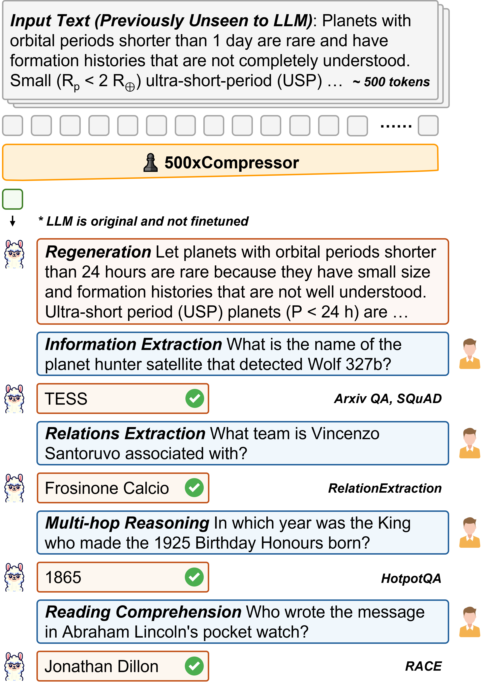
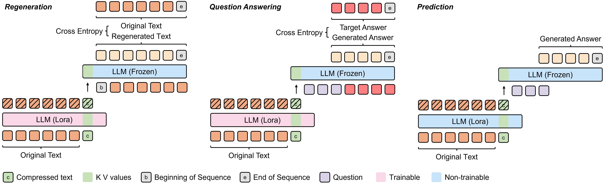
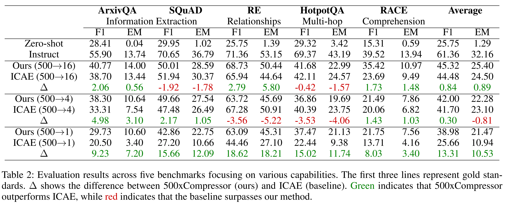

# 🎓 500xCompressor: Generalized and Non-retrieval Prompt Compression for Large Language Models

<p align="center">
  <b>Content</b>
</p>

<p align="center">
  <a href="#news">🚀News</a> •
  <a href="#todo">✏️Todo</a> •
  <a href="#introduction">✨Introduction</a>
</p>

<p align="center">
  <a href="#corpus">📚Corpora</a> •
  <a href="#dataset">🤗Datasets</a> •
  <a href="#model">🤗Models</a> •
  <a href="#algorithm">🖥️Algorithm</a>
</p>

<p align="center">
  <a href="#download">💾 Download</a> •
  <a href="#citation">📌Citation</a> •
  <a href="#license">🔖License</a>
</p>

<p align="center">
  <b>Links</b>
</p>

<p align="center">
  <a href="">Project Page</a> •
  <a href="https://huggingface.co/spaces/ZongqianLi/SolarCellBERT">Demo Page</a> •
  <a href="">Paper</a>
</p>

<div id="news">&nbsp;</div>


## 🚀 News
- **[2024.06.26]** Create the github page!

<div>&nbsp;</div>
<div>&nbsp;</div>
<div id="todo">&nbsp;</div>


## ✏️ Todo
- [x] Create the github page!

<div>&nbsp;</div>
<div>&nbsp;</div>
<div id="introduction">&nbsp;</div>


## ✨ Introduction
To be finished.

<p align="center">
  
</p>

<div>&nbsp;</div>
<div>&nbsp;</div>
<div id="corpora">&nbsp;</div>


## 📚 Arxiv Corpus

This is a collections of Arxiv abstracts.

- **Train:** 2353924 items, based on Arxiv abstracts before 07/2023
- **Validation:** 3000 items, based on Arxiv abstracts during 01-04/2024
- **Test:** 2500 items, based on Arxiv abstracts during 01-04/2024

<div>&nbsp;</div>
<div>&nbsp;</div>
<div id="corpus">&nbsp;</div>


## 🤗 ArxivQA Dataset

This is an extractive QA dataset created based on the abstracts of Arxiv papers.

- **Train:** 250000 items, based on Arxiv abstracts before 07/2023
- **Validation:** 1000 items, based on Arxiv abstracts before 07/2023
- **Test:** 1000 items, based on Arxiv abstracts during 01-04/2024

<div>&nbsp;</div>
<div>&nbsp;</div>
<div id="dataset">&nbsp;</div>


## 🤗 500xCompressor
### Quick use for regeneration:
```
# codes
```
```
# output
```

### Quick use for QA:
```
# codes
```
```
# output
```

### Training process: 
To be finished.

<div>
  <center>
  
</div>

### Performance: 
To be finished.

<div>
  <center>
  
</div>

<div>&nbsp;</div>
<div>&nbsp;</div>
<div id="model">&nbsp;</div>


## 💾 Download
The models are the **LORA** parameters for finetuning LLaMa-3-8b-Instruct. **Regeneration** means pretraining the compression model to regenerate the original text based on the compressed tokens. **QA** means finetuning the compression model for extractive QA based on the compressed tokens. **500->X** means 500 tokens in the original text are compressed into X special token.
- [ArxivQA Dataset](https://huggingface.co/datasets/ZongqianLi/ArxivQA)
- [Ours: 500xCompressor Regeneration & QA (500->16, 500->4, 500->1) (2*3 models)](https://huggingface.co/collections/ZongqianLi/500xcompressor-66b24b2db2efe5732539a3d3)
- [Baselines: ICAE Regeneration & QA (500->16, 500->4, 500->1) (2*3 models)](https://huggingface.co/collections/ZongqianLi/icae-66b250fdc40442c79e9fb88c)

<div>&nbsp;</div>
<div>&nbsp;</div>
<div id="citation">&nbsp;</div>


## 📌 Citation
```
cite
```

<div>&nbsp;</div>
<div>&nbsp;</div>
<div id="license">&nbsp;</div>


## 🔖 License
```
license
```

