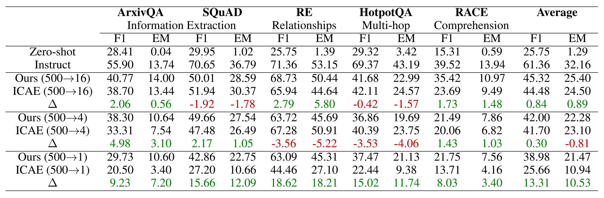

# [ACL 2025 Main] ♟️ 500xCompressor: Generalized Prompt Compression for Large Language Models

<p align="center">
  <b>Content</b>
</p>

<p align="center">
  <a href="#news">🚀News</a> •
  <a href="#todo">✏️Todo</a> •
  <a href="#introduction">✨Introduction</a>
</p>

<p align="center">
  <a href="#corpus">📚Corpus</a> •
  <a href="#dataset">🤗Dataset</a> •
  <a href="#model">🤗Models</a>
</p>

<p align="center">
  <a href="#download">💾 Download</a> •
  <a href="#citation">📌Citation</a> •
  <a href="#license">🔖License</a>
</p>

<p align="center">
  <b>Links</b>
</p>

<p align="center">
  <a href="">Project Page</a> •
  <a href="">Demo Page</a> •
  <a href="https://arxiv.org/abs/2408.03094">Paper</a>
</p>

<div id="news">&nbsp;</div>


## 🚀 News

- **[2024.08.06]** The paper was uploaded to Arxiv.

<div>&nbsp;</div>
<div>&nbsp;</div>
<div id="todo">&nbsp;</div>


## ✏️ Todo

- [ ] Datasets and models were uploaded to Huggingface but are not open to the public.

<div>&nbsp;</div>
<div>&nbsp;</div>
<div id="introduction">&nbsp;</div>


## ✨ Introduction

**500xCompressor** is a **prompt compression method** that could compresss a maximum of **500** natural language tokens into only **1** special token. This compressed token could **regenerate** the original text or be used for **question answering (QA)**.

Initially, 500xCompressor was pretrained on the **Arxiv Corpus**, followed by fine-tuning on the **ArxivQA dataset**, and subsequently evaluated on various **strictly unseen** and **classical** **QA** datasets.

500xCompressor has several **features and advantages**:
- **Small additional parameters:** only **0.3% extra** parameters are added to the LLM
- **Zero-shot usage:** the compressed tokens can be used by the original LLM **without being finetuned**
- **High compression ratio:** from **6x** to **480x**
- **Generalization ability:** could compress any **unseen** text and be used for **unseen** datasets in downstream tasks
- **Non-selective:** compress **all** the tokens in the prompt instead of choosing partial tokens
- **Retained capabilities:** **62.26-72.89%** of LLM abilities compared to using non-compressed prompts

This research gave several **insights**:
- **Not** all the compressed tokens are **equally** utilized
- **K V values** have significant advantages over **embeddings** in preserving information at high compression ratios
- Natural language prompts are **highly compressive**
- **Fine-grained complex** information could be compressed and retrieved exactly as well

Here is an example:

<p align="left">
  
</p>

<div>&nbsp;</div>
<div>&nbsp;</div>
<div id="corpus">&nbsp;</div>


## 📚 Arxiv Corpus

This is a collection of **Arxiv abstracts**:

- **Train:** 2353924 items, based on Arxiv abstracts before 07/2023
- **Validation:** 3000 items, based on Arxiv abstracts during 01-04/2024
- **Test:** 2500 items, based on Arxiv abstracts during 01-04/2024

<div>&nbsp;</div>
<div>&nbsp;</div>
<div id="dataset">&nbsp;</div>


## 🤗 ArxivQA Dataset

This is an **extractive QA dataset** created based on the abstracts of Arxiv papers:

- **Train:** 250000 items, based on Arxiv abstracts before 07/2023
- **Validation:** 1000 items, based on Arxiv abstracts before 07/2023
- **Test:** 1000 items, based on Arxiv abstracts during 01-04/2024

<div>&nbsp;</div>
<div>&nbsp;</div>
<div id="model">&nbsp;</div>


## 🤗 500xCompressor

### Quick use for 500xCompressor (ours):

> **It should be noted that the environment should be the same as the provided environment in /env, or the model might output blank content.**

```
# codes
python 500xCompressor_demo.py
```
```
# Example: 4 tokens compress 96 tokens

# input
context = """We show that every reciprocity sheaf gives rise to a cycle (pre)module in the sense of Rost over a perfect field. Over a perfect field of positive characteristic, we show that the first cohomology group of a logarithmic de Rham-Witt sheaf has a partial cycle module structure. As a consequence, we show that Kato complexes of logarithmic de Rham-Witt sheaves satisfy functoriality properties similar to Rost's cycle complexes."""
question = "Over what type of field do we show that Kato complexes satisfy functoriality properties?"

# output
Regeneration:
Predicted text: We show that every reciprocity sheaf gives rise to a cycle (pre)module in the sense of Rost over a perfect field. Over a perfect field of positive characteristic, we show that the first cohomology group of a logarithmic de Rham-Witt cycle module has a partial cycle structure. As a consequence, we show that Kato modules of logarithmic de Rham-Witt complexes satisfy functorial properties similar to Rost's cycle complexes.
QA:
Predicted text: perfect fields of positive characteristic
```

<div>&nbsp;</div>

### Quick use for ICAE (baseline):

> **It should be noted that the environment should be the same as the provided environment in /env, or the model might output blank content.**

```
# codes
python ICAE_demo.py
```
```
# Example: 4 tokens compress 96 tokens

# input
context = """We show that every reciprocity sheaf gives rise to a cycle (pre)module in the sense of Rost over a perfect field. Over a perfect field of positive characteristic, we show that the first cohomology group of a logarithmic de Rham-Witt sheaf has a partial cycle module structure. As a consequence, we show that Kato complexes of logarithmic de Rham-Witt sheaves satisfy functoriality properties similar to Rost's cycle complexes."""
question = "Over what type of field do we show that Kato complexes satisfy functoriality properties?"

# output
Regeneration:
Predicted text: We show that every sheaf reciprocity gives rise to a cycle (pre)module over a Rost cycle. In the perfect field case, we show that over a positive characteristic field, the first logarithmic de Rham cohomology group of a Witt log-Witt cycle has a partial decomposition. As a consequence, we show that Kato's cycle complexes satisfy functoriality properties similar to Rost cycle complexes.
QA:
Predicted text: a perfect field of characteristic zero
```

<div>&nbsp;</div>

### Training process: 

The compression model was pretrained on the **Arxiv Corpus** for **regenerating** the original text according to the compressed tokens. Then, it was finetuned on the **ArxivQA Dataset** for **answering the questions** based on the compressed tokens.

<p align="left">
  
</p>

<div>&nbsp;</div>

### Performance: 

The compression models were evaluated on various **strictly unseen** and **classic** QA benchmarks.

<p align="left">
  
</p>

The detailed results for **ArxivQA**:

<p align="left">
  
</p>

Here is an **example**:

<p align="left">
  
</p>

<div>&nbsp;</div>
<div>&nbsp;</div>
<div id="download">&nbsp;</div>


## 💾 Download

The models are the **LORA** parameters for finetuning LLaMa-3-8b-Instruct. **Regeneration** means pretraining the compression model to regenerate the original text based on the compressed tokens. **QA** means finetuning the compression model for extractive QA based on the compressed tokens. **500->X** means 500 tokens in the original text are compressed into X special token.
- [ArxivQA Dataset](https://huggingface.co/datasets/ZongqianLi/ArxivQA)
- [Ours: 500xCompressor Regeneration & QA (500->16, 500->4, 500->1) (2*3 models)](https://huggingface.co/collections/ZongqianLi/500xcompressor-66b24b2db2efe5732539a3d3)
- [Baselines: ICAE Regeneration & QA (500->16, 500->4, 500->1) (2*3 models)](https://huggingface.co/collections/ZongqianLi/icae-66b250fdc40442c79e9fb88c)

<div>&nbsp;</div>
<div>&nbsp;</div>
<div id="citation">&nbsp;</div>


## 📌 Citation

```
@misc{li2024500xcompressorgeneralizedpromptcompression,
      title={500xCompressor: Generalized Prompt Compression for Large Language Models}, 
      author={Zongqian Li and Yixuan Su and Nigel Collier},
      year={2024},
      eprint={2408.03094},
      archivePrefix={arXiv},
      primaryClass={cs.CL},
      url={https://arxiv.org/abs/2408.03094}, 
}
```

<div>&nbsp;</div>
<div>&nbsp;</div>
<div id="license">&nbsp;</div>


## 🔖 License

This project is licensed under the Creative Commons Attribution 4.0 International License - see the [LICENSE](https://creativecommons.org/licenses/by/4.0/deed.en) for details.

[](https://creativecommons.org/licenses/by/4.0/)


